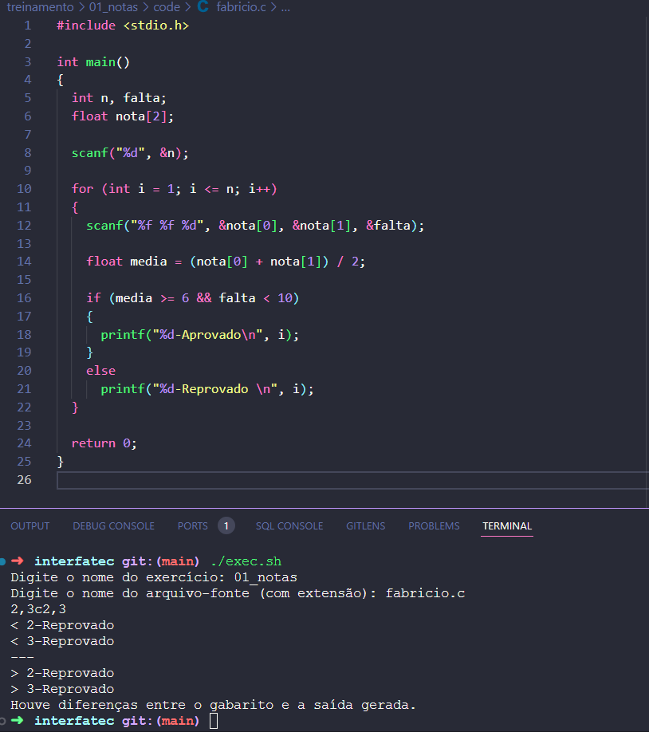

## Referencia dos exercícios

## Programas que devem estar instalado para execução

Para ambientes Unix.
- gcc
- diff

Para ambientes Dos.
...

## Como rodar

Primeiro adicione seu código fonte dentro da pasta code do exercício desejado, após isso execute o seguinte comando e preencha as informações.

```sh
./exec.sh
```

### Execução com erro


### Execução com sucesso

